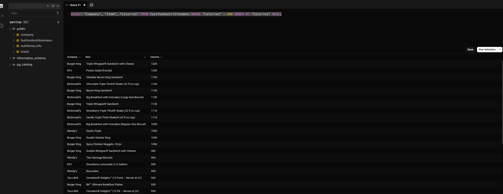

# Entendendo o SELECT

## O Básico a respeito de banco de dados relacionais

### Estrutua básica de uma consulta:

__SELECT__ Nome_do_campo \
__FROM__  Nome_da_Tabela \

- Então o hello world do sql pode vir da seguinte forma:
    - SELECT * FROM fastfoodnutritionmeenu;
    - Onde o * é um curinga, que implica em dizer todos os campos. Assim, pode-se evitar de escrever o nome de todos os campos, quando quiser trazer a tabela inteira.

### Aplicando condição:
__SELECT__ Nome_do_campo \
__FROM__  Nome_da_Tabela \
__WHERE__  condição; *`clásula opcional`*

- Trazendo somente os lanches com calorias maiores que 800:
    - SELECT "Company", "Item", "Calories" FROM fastfoodnutritionmenu WHERE "Calories" > 800;
    - Agora foi informado para trazer apenas algumas colunas, quando a dada condição for respeitada uma condição.

### Aplicando ordenação:
__SELECT__ Nome_do_campo \
__FROM__  Nome_da_Tabela \
__WHERE__  condição; *`clásula opcional`*
__ORDER BY__ Nome_do_campo sentido_da_ordenacao

- Ordenando a consulta anterior:
    - Definindo que a ordem de exibição será por "Calories" (importância de ter a coluna em formato númerico);
    - E definindo que a ordem será decrescente (DESC, pois por padrão é crescente ASC);

